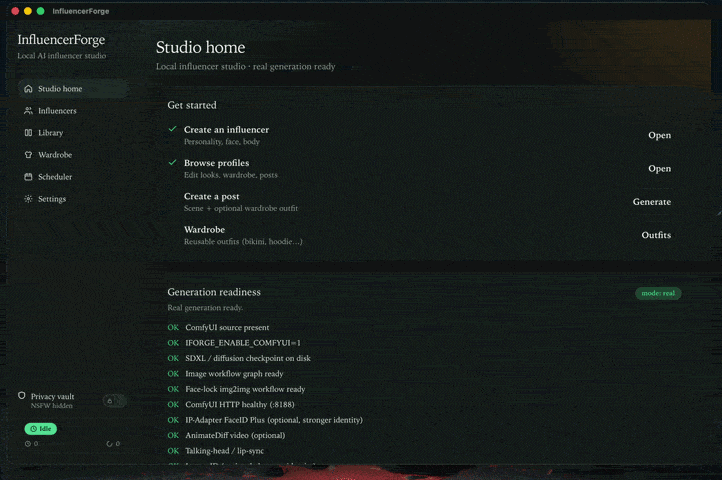

# InfluencerForge

Local-first desktop studio for creating and generating content for AI virtual influencers.

**Stack:** Tauri v2 (Rust) · React 18+/TypeScript · FastAPI (Python) · SQLite  
**License:** MIT · **Spec:** [PROJECT_SPECIFICATION.md](./PROJECT_SPECIFICATION.md)

Phase 1 uses a **stub generator** (Pillow placeholders) and **system / uv venv Python**. Real ComfyUI/SDXL is optional; release builds assemble a portable Python via `scripts/assemble-portable-python.sh` (weights still downloaded separately — see `docs/setup/PACKAGING.md`).



Face identity across posts still needs work — see [known limitations](./docs/setup/REAL_GENERATION.md#face-consistency--known-limitations). Suggestions and PRs welcome.

---

## Quick start (developers)

### Prerequisites

| Tool | Version |
|------|---------|
| Node.js | 20+ |
| Rust | 1.80+ (`rustup`) |
| Python | 3.10+ |
| uv | latest ([install](https://docs.astral.sh/uv/)) |
| Platform webview deps | [Tauri prerequisites](https://v2.tauri.app/start/prerequisites/) |

### Setup

```bash
git clone <your-fork-url> influencer-forge
cd influencer-forge

# Frontend
npm install

# Python orchestrator
cd forge-python
uv sync --all-groups
cd ..

# Optional: run API alone
cd forge-python && uv run forge-orchestrator
# → http://127.0.0.1:8765/api/health
```

### Run the desktop app

```bash
npm run tauri dev
```

This starts Vite on `:1420` and the Tauri shell, which spawns the Python orchestrator (prefers `forge-python/.venv`).

### Tests

```bash
npm test
npm run typecheck
cd forge-python && uv run pytest -q
```

---

## Open-source documentation map

| Doc | Purpose |
|-----|---------|
| [PROJECT_SPECIFICATION.md](./PROJECT_SPECIFICATION.md) | Product + architecture source of truth |
| [CONTRIBUTING.md](./CONTRIBUTING.md) | PR process, Conventional Commits, AI-generated commits |
| [docs/setup/CURSOR.md](./docs/setup/CURSOR.md) | **Cursor IDE setup path** |
| [docs/setup/REAL_GENERATION.md](./docs/setup/REAL_GENERATION.md) | **When CRUD becomes real AI images** |
| [docs/setup/PACKAGING.md](./docs/setup/PACKAGING.md) | Dev vs release, portable Python assemble |
| [docs/setup/RELEASE_VALIDATION.md](./docs/setup/RELEASE_VALIDATION.md) | Cross-platform release smoke checklist |
| [docs/architecture/OVERVIEW.md](./docs/architecture/OVERVIEW.md) | Runtime architecture |
| [docs/modules/README.md](./docs/modules/README.md) | Module index |
| [AGENTS.md](./AGENTS.md) | Instructions for AI coding agents |
| [SECURITY.md](./SECURITY.md) | Vulnerability reporting |
| [CHANGELOG.md](./CHANGELOG.md) | Release notes |

---

## Repository layout

```
influencer-forge/
├── src/                 # React UI
├── src-tauri/           # Rust / Tauri process manager + tray
├── forge-python/        # FastAPI orchestrator + workers
├── docs/                # Architecture & setup docs
├── .cursor/rules/       # Cursor project rules
└── .github/workflows/   # lint.yml + build.yml
```

---

## Status

- Stub generation + full UI/API surface for local development
- Real workflows under `src-tauri/resources/workflows/` (FaceID / img2img / AnimateDiff)
- Face lock helps but **consistent identity is still imperfect** — help welcome ([details](./docs/setup/REAL_GENERATION.md#face-consistency--known-limitations))
- Enable real downloads with `IFORGE_ENABLE_MODEL_DOWNLOADS=1` / `IFORGE_ENABLE_COMFYUI=1`
- Clone ComfyUI into `src-tauri/resources/comfyui/ComfyUI` (see that folder’s README), then set `IFORGE_ENABLE_COMFYUI=1`
- Release packaging: `./scripts/assemble-portable-python.sh` then `npm run tauri build` (see `docs/setup/PACKAGING.md`)
- Edit download targets in `src-tauri/resources/bootstrap/models.json`
